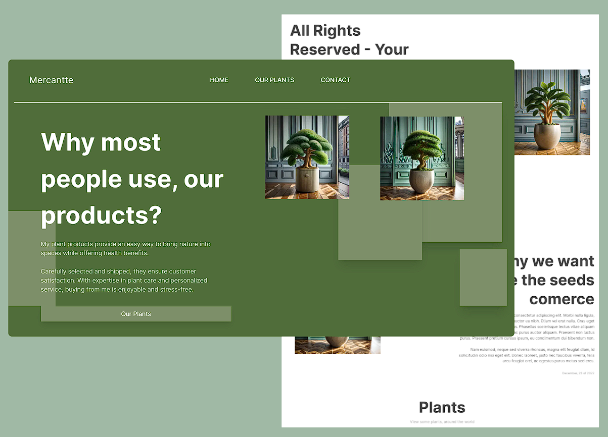

# Mercantte

## Why build this project?
The idea to build this project is build an website using the modern tools as **Figma, Next.js, OpenAi**(API) for my expirience and share my personal way to develop App's 

## Some of observations about this Website

1 - Contact form doesn't work, i might 

2 - The website don't carry all datas about plants around the world, there specifics plants, becaus it isnt possible, thus i don't have money to portable **Huge Datas**

## Contact 
This project is a part of my portifolio, so, i'll be happy if you could me a feedback about this project, code, structure or anything.

Email-me: 

Connect with me at [Linkedin](https://www.linkedin.com/in/huann-vicente-5092a9261/)

## Functionalaties 🎉

## Production 

[On live](https://github.com/HuannAnd/Mercantte)
